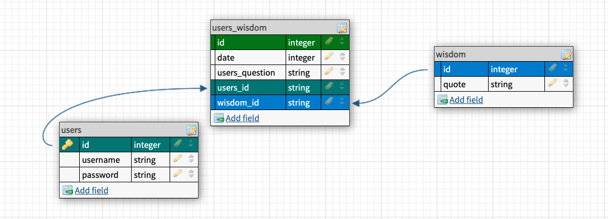
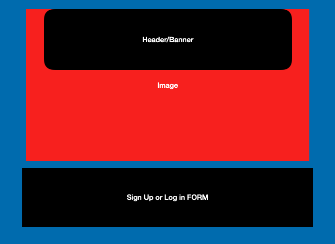
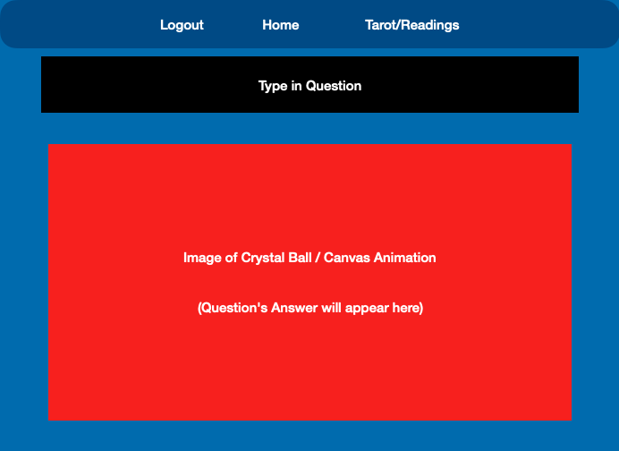

# ✨✨✨ 🔮 Madame's Parlor of Fortune 🔮 ✨✨✨

### Description:

Our user is someone on-the-go seeking advise. Our app will be a one-stop-shop that offers many different types of wisdom and advice. Whether you need a daily horoscope, a reading from a fortune teller or words of wisdom from a magic-8 ball, you are covered. Also, the user may log back into their account to see past dated readings.

### User Story:

1.  The user first sees the log in page. They are given the option to sign in or sign up.

2.  Once logged in the user's home page greets them. It also reveals the navigation bar.

3.  The navigation bar offers 3 choices:

    a. Logout

    b. User's Homepage

    c. Crystal ball

4.  The user's homepage is a space unique to them. There is a display of past readings, so they can reflect on them.

5.  The user can click to generate advise from the crystal ball, and it will show in their homepage automatically. And the user will stay on the crystal ball page.

6.  Log out returns you to the sign in page, with a temporary modal that says "Bye!"

### MVP:

1. 4 pages in Schema (Login, Users Home, Crystal Ball & Logout).

2. mernAuth to protect User's passwords

3. Collections in Mongo DB: User's info, Wisdom from the Crystal Ball (Hardcoded) & an embedded schema
   which appears on user's homepage (question asked by the crystal ball, it's answer & date of question).
   \*\*\* Data will be stored on homepage for user to see!

4. A nav bar with routes.

5. A log out page that removes you auth data, and routes you back to the login page.

### Stretch:

1. Have another readings page (Horoscope or Tarot) that works with an outside API. And also saves to the user's homepage.

2. Create a "choose you our adventure game" using ruin stones. Using JS logic. This page will start with a few choices and as you go you will create an output specific to the user. This will be saved on their homepage.

3. Styling: Make the app look like walking into a vintage fortune teller's parlor. The home page will feature an image of our fortune teller, as well as CSS styling details, a goodbye modal, sound effects and a bit of canvas animation over the crystal ball where your answers appear.

4. Make comments on saved info to pages.

5. "Your day at a glance!"- pop up prompt (like a fortune cookie).

### Group Roles:

Semuel- mernAuth

Erin- Visuals, site structuring

Nakisha- front end/react

Brinn- Back end/mongo db

### Git Master:

Erin

### Sprints:

Est. of day 1- Create a repo, and the whole group interacts with is. Structure the site (lay it out), and place
routes. Structure Crystal Ball modules in db.

### Routes:

Login "/login"
(incorrect login goes to /noAuth ---> /login)

Users Homepage "/"

Crystal Ball "/crystal-ball"

Logout "/logout"

### Schema:

### Technologies and APIs:

React, Mongoose, MongoDB, mernAuth, Express, Axios, CSS, html, Javascript, Rowdy-Logger, Morgan, React-Router-Dom, Canvas, [Mystic API](https://rapidapi.com/mysticscripts/)

### Wire Frames:

